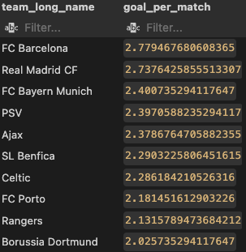

# European Football League Data Analysis using PostgreSQL

In this exciting project, I explored the [European Soccer Database](https://www.kaggle.com/datasets/hugomathien/soccer) available on Kaggle, originally in SQLite format. I transformed the data into a PostgreSQL database and conducted an in-depth Exploratory Data Analysis (EDA) to uncover intriguing insights about the world of football.

**Project Steps:**

1. **Data Download:** I downloaded the European Soccer Database in SQLite format from Kaggle using [this link](https://www.kaggle.com/datasets/hugomathien/soccer).

2. **CSV Creation:** Utilizing the `csv_maker.py` script, I extracted data from 7 tables in the SQLite file and uploaded CSV files for 5 of them. So,*`you have to use this file to create "match.csv" and "player_attributes.csv" file for the next process.`*

3. **PostgreSQL Database Creation:** I created a PostgreSQL database using my username and other relevant details. No table creation was required at this stage, but I ensured that all datasets were available in the Datasets folder. By running the `table_creation.sql` file, I efficiently created and exported the necessary tables into my PostgreSQL database.

4. **Explanatory Data Analysis:** The fascinating `football_project_database.sql` file contains answers to several intriguing questions:

   - **What are the top 30 teams with the highest average overall rating?**

     ```sql
     SELECT team_long_name,
            ROUND((buildUpPlaySpeed +
                   CASE WHEN buildUpPlayDribbling IS NULL 
                        THEN (SELECT ROUND(AVG(buildUpPlayDribbling), 2) FROM team_attributes)
                        ELSE buildUpPlayDribbling END +
                   buildUpPlayPassing +
                   chanceCreationPassing +
                   chanceCreationCrossing +
                   chanceCreationShooting +
                   defencePressure +
                   defenceAggression +
                   defenceTeamWidth) / 9, 2) AS overall_rating
     FROM team_attributes
     LEFT JOIN team USING (team_api_id)
     ORDER BY overall_rating DESC
     LIMIT 30;
     ```

     

   - **Which team has the highest goal-scoring rate (goals scored per match)?**

     ```sql
     WITH goal_by_team AS (
         SELECT match_api_id, home_team_api_id AS team_api_id, home_team_goal AS goal
         FROM match
         UNION
         SELECT match_api_id, away_team_api_id AS team_api_id, away_team_goal AS goal
         FROM match
     )
     SELECT team_long_name, goal_per_match
     FROM (SELECT team_api_id, SUM(goal)::FLOAT / COUNT(team_api_id) AS goal_per_match
           FROM goal_by_team
           GROUP BY team_api_id) AS t1
     LEFT JOIN team USING (team_api_id)
     ORDER BY goal_per_match DESC
     LIMIT 10;
     ```

     

   - **Who is the best player from 2008 to 2016?**

     ```sql
     SELECT player_name, overall_rating,
            EXTRACT(YEAR FROM now()) - EXTRACT(YEAR FROM birthday) AS age,
            height, weight
     FROM (SELECT player_api_id, ROUND(AVG(overall_rating), 2) AS overall_rating
           FROM player_attributes
           WHERE overall_rating IS NOT NULL
           GROUP BY player_api_id) AS t1
     LEFT JOIN player USING (player_api_id)
     ORDER BY overall_rating DESC
     LIMIT 20;
     ```

     

   - **Analyzing the performance of Real Madrid (Team ID: 8633) over the years.**

     ```sql
     WITH team_result AS (
         SELECT home_team_api_id, away_team_api_id, home_team_goal, away_team_goal,
                CASE WHEN (home_team_api_id = 8633 AND home_team_goal > away_team_goal) OR
                          (away_team_api_id = 8633 AND home_team_goal < away_team_goal)
                     THEN 'Won'
                     WHEN (home_team_api_id = 8633 AND home_team_goal < away_team_goal) OR
                          (away_team_api_id = 8633 AND home_team_goal > away_team_goal)
                     THEN 'Lost'
                     WHEN home_team_goal = away_team_goal
                     THEN 'Draw' END AS result
         FROM match
         WHERE home_team_api_id = 8633 OR away_team_api_id = 8633
     )
     SELECT result, COUNT(*)
     FROM team_result
     GROUP BY result;
     ```

     

   - **Determining the team with the most wins.**

     ```sql
     WITH winner_teams AS (
         SELECT winner, COUNT(*) AS wins
         FROM (SELECT match_api_id, home_team_api_id, home_team_goal, away_team_goal, away_team_api_id,
                      CASE WHEN home_team_goal > away_team_goal THEN home_team_api_id
                           WHEN home_team_goal < away_team_goal THEN away_team_api_id
                           ELSE NULL END AS winner
               FROM match) AS t1
         GROUP BY winner
         HAVING winner IS NOT NULL
         ORDER BY wins DESC
     )
     SELECT team_long_name, wins
     FROM winner_teams
     LEFT JOIN team ON winner_teams.winner = team.team_api_id
     LIMIT 20;
     ```

     

   - **Identifying the best teams in the German, English, French, Spanish, and Italian leagues.**

     ```sql
     WITH winner_teams AS (
         SELECT winner, COUNT(*) AS wins
         FROM (SELECT match_api_id, home_team_api_id, home_team_goal, away_team_goal, away_team_api_id,
                      CASE WHEN home_team_goal > away_team_goal THEN home_team_api_id
                           WHEN home_team_goal < away_team_goal THEN away_team_api_id
                           ELSE NULL END AS winner
               FROM match
               WHERE league_id IN (1729, 4769, 7809, 10257, 21518)) AS t1
         GROUP BY winner
     ),
     loser_teams AS (
         SELECT loser, COUNT(*) AS losses
         FROM (SELECT match_api_id, home_team_api_id, home_team_goal, away_team_goal, away_team_api_id,
                      CASE WHEN home_team_goal < away_team_goal THEN home_team_api_id
                           WHEN home_team_goal > away_team_goal THEN away_team_api_id
                           ELSE NULL END AS loser
               FROM match
               WHERE league_id IN (1729, 4769, 7809, 10257, 21518)) AS t2
         GROUP BY loser
     ),
     draw_teams AS (
         SELECT draw_team, COUNT(*) AS draws
         FROM (SELECT match_api_id,
                      CASE WHEN home_team_goal = away_team_goal THEN home_team_api_id END AS draw_team
               FROM match
               UNION
               SELECT match_api_id,
                      CASE WHEN home_team_goal = away_team_goal THEN away_team_api_id END AS draw_team
               FROM match
               WHERE league_id IN (1729, 4769, 7809, 10257, 21518)) AS t3
         GROUP BY draw_team
     )
     SELECT team_long_name, wins, losses, draws, (wins * 3 + draws) AS points
     FROM winner_teams AS w
     LEFT JOIN loser_teams AS l ON w.winner = l.loser
     LEFT JOIN draw_teams AS d ON l.loser = d.draw_team
     LEFT JOIN team ON d.draw_team = team.team_api_id
     WHERE team_long_name IS NOT NULL
     ORDER BY points DESC
     LIMIT 50;
     ```

     


Feel free to run this code on different files each time to obtain insightful results.

For a detailed exploration of the European Football League data analysis and to witness the thrilling SQL queries, check the respective scripts and SQL files in the repository. Experience the excitement of football data come alive through the power of PostgreSQL!
